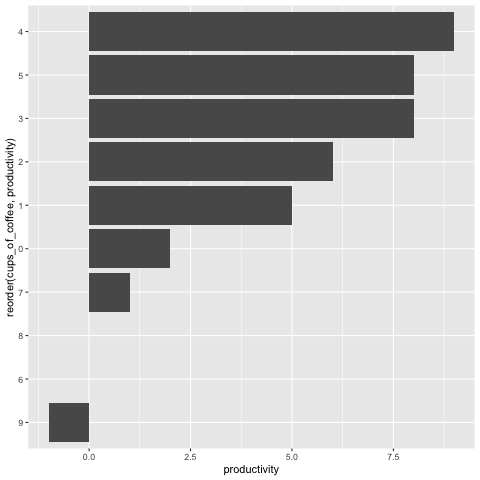

```python
%load_ext rpy2.ipython
```


```python
import pandas as pd
import numpy as np
df = pd.DataFrame({
    'cups_of_coffee': [0, 1, 2, 3, 4, 5, 6, 7, 8, 9],
    'productivity': [2, 5, 6, 8, 9, 8, 0, 1, 0, -1]
})
df.transpose()
```


<div>
<style scoped>
    .dataframe tbody tr th:only-of-type {
        vertical-align: middle;
    }

    .dataframe tbody tr th {
        vertical-align: top;
    }

    .dataframe thead th {
        text-align: right;
    }
</style>
<table border="1" class="dataframe">
  <thead>
    <tr style="text-align: right;">
      <th></th>
      <th>0</th>
      <th>1</th>
      <th>2</th>
      <th>3</th>
      <th>4</th>
      <th>5</th>
      <th>6</th>
      <th>7</th>
      <th>8</th>
      <th>9</th>
    </tr>
  </thead>
  <tbody>
    <tr>
      <th>cups_of_coffee</th>
      <td>0</td>
      <td>1</td>
      <td>2</td>
      <td>3</td>
      <td>4</td>
      <td>5</td>
      <td>6</td>
      <td>7</td>
      <td>8</td>
      <td>9</td>
    </tr>
    <tr>
      <th>productivity</th>
      <td>2</td>
      <td>5</td>
      <td>6</td>
      <td>8</td>
      <td>9</td>
      <td>8</td>
      <td>0</td>
      <td>1</td>
      <td>0</td>
      <td>-1</td>
    </tr>
  </tbody>
</table>
</div>


```r
%%R -i df 
library(ggplot2)
ggplot(df, aes(x=reorder(cups_of_coffee,productivity), y=productivity)) + geom_col() + coord_flip()
```


    

    


```r
%%R -i df -o transformed_df
library(dplyr)
transformed_df = df %>% 
    select(-cups_of_coffee) %>% 
    mutate(prod = productivity * 2)
```


```python
transformed_df.head()
```


<div>
<style scoped>
    .dataframe tbody tr th:only-of-type {
        vertical-align: middle;
    }

    .dataframe tbody tr th {
        vertical-align: top;
    }

    .dataframe thead th {
        text-align: right;
    }
</style>
<table border="1" class="dataframe">
  <thead>
    <tr style="text-align: right;">
      <th></th>
      <th>productivity</th>
      <th>prod</th>
    </tr>
  </thead>
  <tbody>
    <tr>
      <th>0</th>
      <td>2</td>
      <td>4.0</td>
    </tr>
    <tr>
      <th>1</th>
      <td>5</td>
      <td>10.0</td>
    </tr>
    <tr>
      <th>2</th>
      <td>6</td>
      <td>12.0</td>
    </tr>
    <tr>
      <th>3</th>
      <td>8</td>
      <td>16.0</td>
    </tr>
    <tr>
      <th>4</th>
      <td>9</td>
      <td>18.0</td>
    </tr>
  </tbody>
</table>
</div>


```python
%R transformed_df %>% skimr::skim()
```


<div>
<style scoped>
    .dataframe tbody tr th:only-of-type {
        vertical-align: middle;
    }

    .dataframe tbody tr th {
        vertical-align: top;
    }

    .dataframe thead th {
        text-align: right;
    }
</style>
<table border="1" class="dataframe">
  <thead>
    <tr style="text-align: right;">
      <th></th>
      <th>skim_type</th>
      <th>skim_variable</th>
      <th>n_missing</th>
      <th>complete_rate</th>
      <th>numeric.mean</th>
      <th>numeric.sd</th>
      <th>numeric.p0</th>
      <th>numeric.p25</th>
      <th>numeric.p50</th>
      <th>numeric.p75</th>
      <th>numeric.p100</th>
      <th>numeric.hist</th>
    </tr>
  </thead>
  <tbody>
    <tr>
      <th>1</th>
      <td>numeric</td>
      <td>productivity</td>
      <td>0</td>
      <td>1.0</td>
      <td>3.8</td>
      <td>3.823901</td>
      <td>-1.0</td>
      <td>0.25</td>
      <td>3.5</td>
      <td>7.5</td>
      <td>9.0</td>
      <td>▇▂▂▂▆</td>
    </tr>
    <tr>
      <th>2</th>
      <td>numeric</td>
      <td>prod</td>
      <td>0</td>
      <td>1.0</td>
      <td>7.6</td>
      <td>7.647803</td>
      <td>-2.0</td>
      <td>0.50</td>
      <td>7.0</td>
      <td>15.0</td>
      <td>18.0</td>
      <td>▇▂▂▂▆</td>
    </tr>
  </tbody>
</table>
</div>


```python

```

    An error occured.
    ValueError: 
    "jupyterlab-jupytext@1.1.1" is not compatible with the current JupyterLab
    Conflicting Dependencies:
    JupyterLab              Extension       Package
    >=3.0.10 <3.1.0         >=1.0.0 <2.0.0  @jupyterlab/application
    >=3.0.8 <3.1.0          >=1.0.0 <2.0.0  @jupyterlab/apputils
    >=3.0.10 <3.1.0         >=1.0.0 <2.0.0  @jupyterlab/notebook
    See the log file for details:  /var/folders/2_/z54fn6nd1lz8t14x8fd31tgw0000gp/T/jupyterlab-debug-hv_i9k2h.log


```python

```
